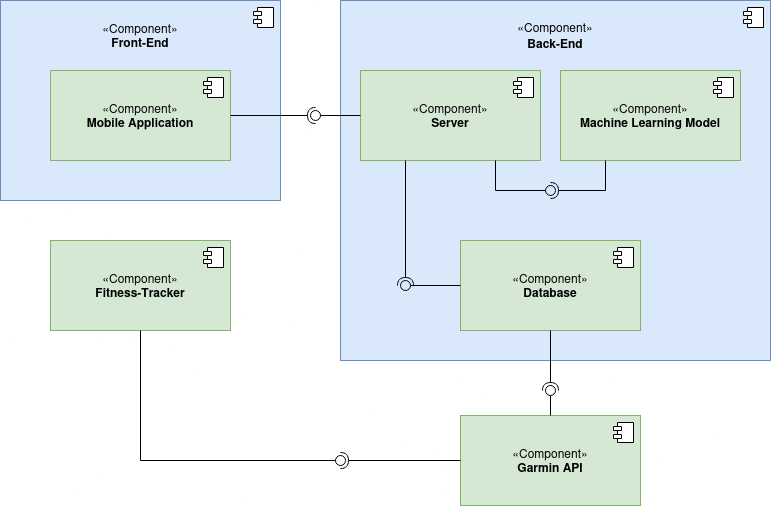
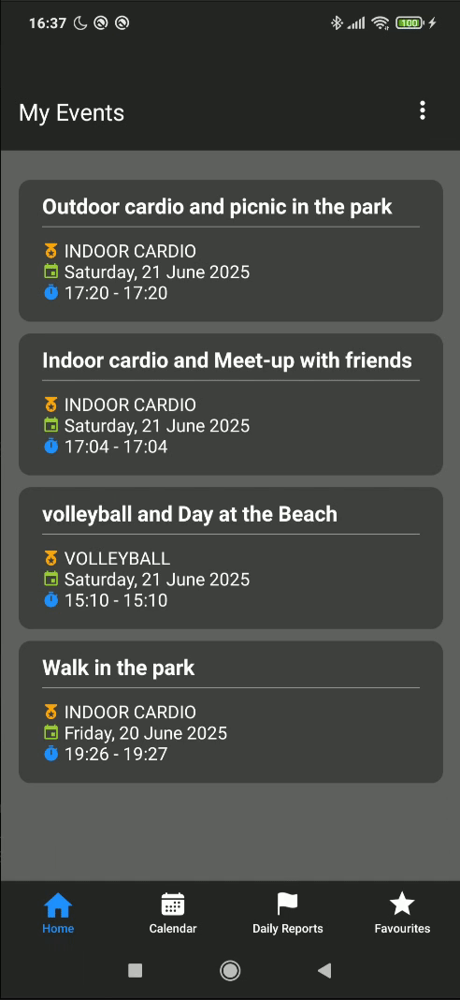
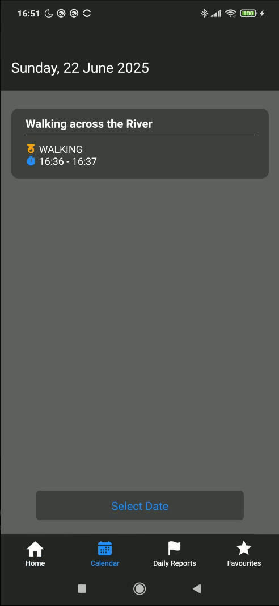
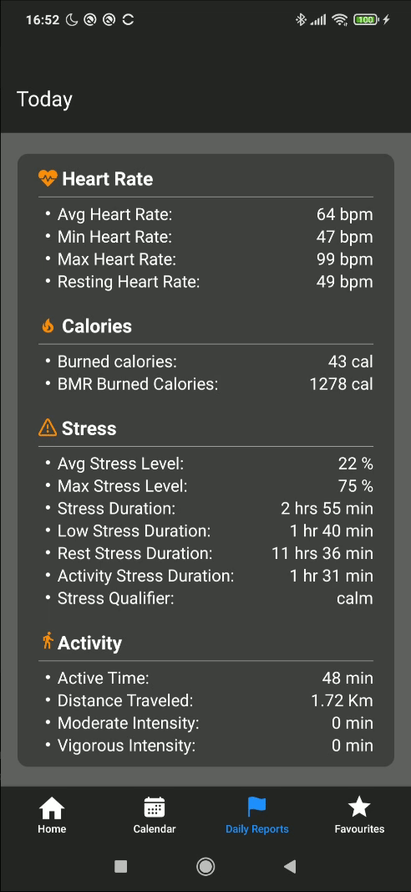

# SmartFit Journal

## Badges

> [](https://opensource.org/licenses/MIT) 
> [](/src/frontend/SmartFit)
> [](/src/frontend/SmartFit)
> [](/src/backend)
> [](/src/backend/models)
> [](src/backend/SQLSchema.sql)

A mobile application that integrates fitness tracker data with calendar events, providing users with more context around their health and activity patterns.

<div align="center">
  
</div>

## Structure

The whole project consists of 4 main sub-components:
>
> - [Mobile Application](src/frontend/SmartFit): The main application that users run on their mobile devices
> - [Server](src/backend): The back-end side is responsible for managing and processing data
> - [Database](src/backend/SQLSchema.sql): Main storage area for the data collected by the fitness tracker
> - [ML Model](src/backend/models): Used to predict whether an activity and a calendar event are related

<div align="center">
  
</div>

## Dependencies

> This project depends on the following software components:
>
> - [Garmin Connect Activity API](https://developer.garmin.com/gc-developer-program/activity-api/) - retrieves detailed activity data (e.g., workouts, steps, distances) from the user's Garmin Connect account
> - [Garmin Connect Health API](https://developer.garmin.com/gc-developer-program/health-api/) - accesses broader health metrics such as sleep, heart rate, and stress levels
> - [Firebase Authentication](https://firebase.google.com/products/auth) - handles secure user login and session management
> - [React Native](https://reactnative.dev/docs/environment-setup) - used for building the cross-platform mobile application
> - [Expo](https://docs.expo.dev/) - streamlines React Native development and deployment
> - [Node.js](https://nodejs.org/en) - used for running backend scripts, handling APIs and serving development tools

## Installation

**Prerequisites**
In order to install and run this application as a developer it is necessary to have a Garmin developer account and request access to their API (Activity API and Health API). <br> More information can be found at: https://developer.garmin.com/gc-developer-program/overview/.

**Requirements**
- React Native 0.79.2
- Expo 53.0.9
- Node.js 24.0.3
- Python 3.12.3
- PostgreSQL 16.9

**Clone the repository**
In a Linux terminal enter: `git clone https://github.com/MauiMoz/smart-fit-journal.git`

**Creating a PostgreSQL database:**
Install PostgreSQL by following the instructions on https://www.postgresql.org/download/

In the terminal:
1. Start PostgreSQL service: `sudo systemctl start postgresql`
2. PostgreSQL creates a default user named "postgres" during installation. Switch to the postgres user: `sudo -i -u postgres`
   Optionally, you can create a new database user: `createuser --interactive`
3. Create a new database: `createdb <database_name>`
4. To interact with the database, in the postgreSQL command line, enter the command: `psql <database_name>`
5. Set a password for the database entering the command: `ALTER USER postgres WITH PASSWORD '<password>';`
In the git repository, navigate to "/smart-fit-journal/src/backend", open the .env file and save the password under the "DATABASE_PASSWORD" environmental variable.
Do the same for the database name. Make sure to install dotenv with: `npm install dotenv`
5. In the git repository, in the terminal, navigate to "/smart-fit-journal/src/backend". Open the file "SQLSchema.sql".
Here you can find the tables you need. Copy them and insert them in the database. You can see the tables with the command: `\dt`
7. To leave the database use `\q`, to leave postgres "ctrl+D".

### Back-End

Install the packages from package.json: `npm install`

**Set Environmental Variables**
1. Open the .env file
2. Replace the placeholders with the actual values

**Create HTTPS keys using Let's Encrypt:**
More information can be found at: https://certbot.eff.org/instructions.

1. Install Certbot:
    - `sudo apt update`
    - `sudo apt install certbot`
    
2. To generate the keys:
    - `sudo certbot certonly --standalone -d <your_domain>`
    
**Create a Python virtual environment using venv**
More information can be found at: https://python.land/virtual-environments/virtualenv.

1. In the terminal, navigate to: /smart-fit-journal/src/backend/models.
2. Create virtual environment: `python3 -m venv <environment_name>`, (usually venv is used as a name)
3. Activate the environment: `source <environment_name>/bin/activate`
4. Install requirements: `pip install -r requirements.txt`
5. Start the FastAPI for the ML model: `uvicorn model_api:app --host 0.0.0.0 --port 8000 --reload`
6. Press `ctrl + C`
7. Deactivate the environment: `deactivate`

Keep the API running as a service:
1. In the terminal: `sudo nano /etc/systemd/system/fastapi.service`
2. Insert the following:

```
[Unit]
Description=FastAPI application
After=network.target

[Service]
User=<your_user_name>

WorkingDirectory=/<path_to_cloned_repository>/smart-fit-journal/src/backend/models
ExecStart=/<path_to_cloned_repository>/smart-fit-journal/src/backend/models/venv/bin/uvicorn model_api:app --host 0.0.0.0 --port 8000 --reload
Restart=always

[Install]
WantedBy=multi-user.target
```

The working directory could look something like this:
/home/<your_user_name>/<path_to_cloned_repository>/smart-fit-journal/src/backend/models

**Train the Machine Learning model**
The model can be trained with some initial data. Nevertheless, this is not enough data to make the model work properly and it will only pivot it towards a positive result all the time.

Train the model: `python3 train_model.py`. This will create a new model if there is not an existing one yet.

**Run the Node.js Server**
Go to: `smart-fit-journal/src/backend`
The server can be started with: `sudo node authServer.js`. This is useful for debugging.

To keep the server running:
1. Install pm2: `npm install -g pm2`
2. Start the server: `pm2 start authServer.js`. You can check if it is running with `pm2 status`
3. Save the process list: `pm2 save`
4. Enable running after system reboot: `pm2 startup`

To stop the server use `pm2 stop authServer.js`, to restart it `pm2 restart authServer.js`.

More information at: https://www.npmjs.com/package/pm2

### Front-End

**Setting a Firebase authentication**
1. Go to: `https://console.firebase.google.com/` and select "Create a Firebase project"
2. After the project is created, go to the Firebase console and select your project
3. Select 'Web App' (this icon: `</>`) and register the app
4. In the console select the settings icon next to 'Project Overview' and select 'Project settings'
5. Under 'Your apps' select your application (it is under Web apps)
6. In the code snippet, select the content of `const firebaseConfig = {...};` and copy it
7. In your IDE, go to `/src/frontend/SmartFit/firebaseConfig.js`
8. Insert the copied content inside `const firebaseConfig = {};`
9. Go back to the Firebase console and select 'Authentication' -> Sign-in method
10. Select Email/Password as a provider and enable it

**Create an Expo Development Build**
Open the application in an IDE (i.e. VSCode)

You need to have an Expo account in order to use the development build. You can create one at https://expo.dev/signup.

Create a development build:
1. Open the project and navigate to `smart-fit-journal/src/frontend/SmartFit`
2. Install the packages from package.json: `npm install`
3. Log in to your Expo account: `eas login`
4. Initialise EAS: `eas init`
5. Open `app.json` and, inside "expo" and before "extras", add the following:

```
    "name": "SmartFit",
    "slug": "smartfit",
    "version": "1.0.0",
    "orientation": "portrait",
    "icon": "./assets/images/icon.png",
    "scheme": "smartfit",
    "userInterfaceStyle": "automatic",
    "newArchEnabled": true,
    "ios": {
      "supportsTablet": true
    },
    "web": {
      "bundler": "metro",
      "output": "static",
      "favicon": "./assets/images/favicon.png"
    },
    "plugins": [
      "expo-router",
      [
        "expo-splash-screen",
        {
          "image": "./assets/images/splash-icon.png",
          "imageWidth": 200,
          "resizeMode": "contain",
          "backgroundColor": "#000000"
        }
      ],
      "expo-web-browser"
    ],
    "experiments": {
      "typedRoutes": true
    },
```

6. Build the native app (Android): `eas build --platform android --profile development` (When asked "Generate a new Android Keystore?" enter 'yes')
   Build the native app (iOS): `eas build --platform ios --profile development`
7. Using a scanner application on your mobile device, scan the QR code and copy the link that appears
8. Paste the text in a web browser
9. Follow the instructions and install the development build
10. In the terminal, start Expo: `npx expo start`
11. Scan the new QR code
12. Open the build on your mobile device and select the application
13. Set environmental variables

More information can be found at: https://docs.expo.dev/develop/development-builds/create-a-build/

**Set Environmental Variables**
1. Open the `.env` file
2. Change the value of `EXPO_PUBLIC_CALLBACK_ADDRESS` with your callback address used by Garmin

## Usage

Before starting make sure that Bluetooth is enabled on your mobile device and that your fitness tracker is in sync with Garmin Connect

Based on the instructions described above:
1. Go to: `smart-fit-journal/src/backend`. 
   Start the Node.js server: `sudo nano authServer.js`
    - Expected output: 
    ```
    HTTPS server running at https://localhost:443
    Client connected: <id>
    Access Token: <Access_Token>
    Access Token Secret: <Token_Secret>
    Socket <id> joined room <FirebaseID>
    ```
2. Start the client: `npx expo start` (Make sure that the development build is started on your mobile device)
    - Expected output: 
    ```
    LOG  Connected to socket.io server
    LOG  FirebaseID:  <FirebaseID>
    ```
3. To test super-event creation:
    a. Create a calendar event on your mobile device's system calendar app
    b. Start an activity (either on the wearable device or directly on Garmin Connect)
    c. Save the activity. If the app is in foreground the super-event should appear in the home page

## Visuals

<div align="center">



</div>

## Support

For issues or feature requests, please use the GitLab Issues page or send an Email to a11736437@unet.univie.ac.at.

## Roadmap

Possible future improvements:
- Integrate support for additional fitness tracker brands
- Enhance activity-to-event matching using more advanced machine learning models
- Enable editing of saved super-events
- Introduce user personalization settings and preferences
- Incorporate data visualizations to enrich user experience

## Troubleshooting

### Front end
### "Invalid URL host: '`<placeholder>`'"

The issued is caused by the missing value for the environmental variable holding the callback address of the application.
To solve this issue:
1. Open the `.env` file
2. Replace the placeholder of `EXPO_PUBLIC_CALLBACK_ADDRESS` with your callback address (i.e. 'https://mydomainname.com')

### Back end
### "Error: ENOENT: no such file or directory, open '/etc/letsencrypt/live/<your_hosting_address>/fullchain.pem'"

The issue arises because no HTTPS keys have been generated. please refer to [Back-End](### Back-End) for instruction on how to create HTTPS keys using Let's Encrypt.

### " File "/usr/lib/python3/dist-packages/urllib3/util/connection.py", line XX, in create_connection sock.connect(sa) ConnectionRefusedError: [Errno 111] Connection refused"

This problem occurs when there is no FastAPI server running. Please refer to [Back-End](### Back-End) in the section 'Create a Python virtual environment using venv' for the necessary passages to resolve the error.

### "Command '<command name>' not found, but can be installed with: sudo apt install <command_name>"

You need to install the requirements after creating the Python virtual environment. Please refer to [Create a Python virtual environment using venv](Back-End) for more detailed information.

### Front end

### "Project already linked (ID: <project_ID>). To re-configure, remove the "extra.eas.projectId" field from your app config.

This error occurs because the project you are creating is already linked with an existing Expo project. To resolve the error delete the `app.json` file and initialize the project again:
- In the command line, in `smart-fit-journal/src/frontend/SmartFit`, enter `eas init`
Follow the instructions from [Create an Expo Development Build](## Front-End)

## Contributing

Any contribution is welcomed. Please refer to [Installation](## installation) for detailed instructions on how to set up and run this project on your machine.

## Authors and acknowledgment

Special thanks go to the Garmin Developer Program for the API access, and to Dipl.-Ing. Dr. Peter Kalchgruber for his help and support throughout the project.

## License

This project is licensed under the [MIT License](LICENSE).

## Attribution

> This project uses Models from https://huggingface.co/models:
> - 
> - 
